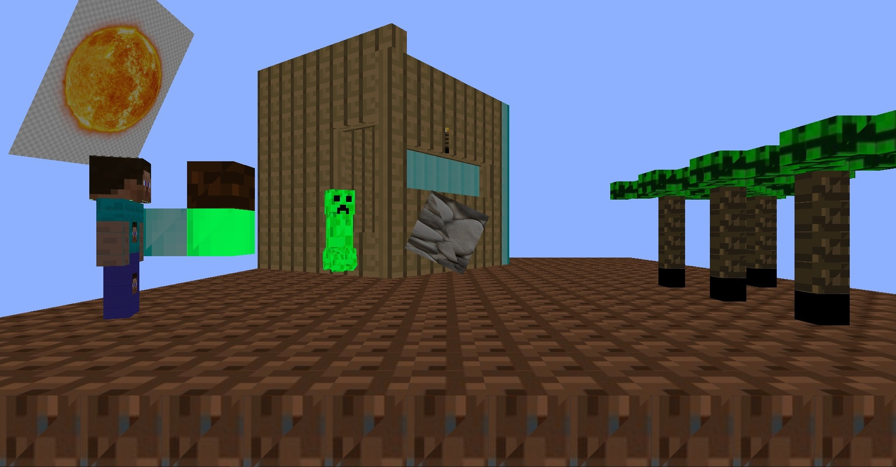
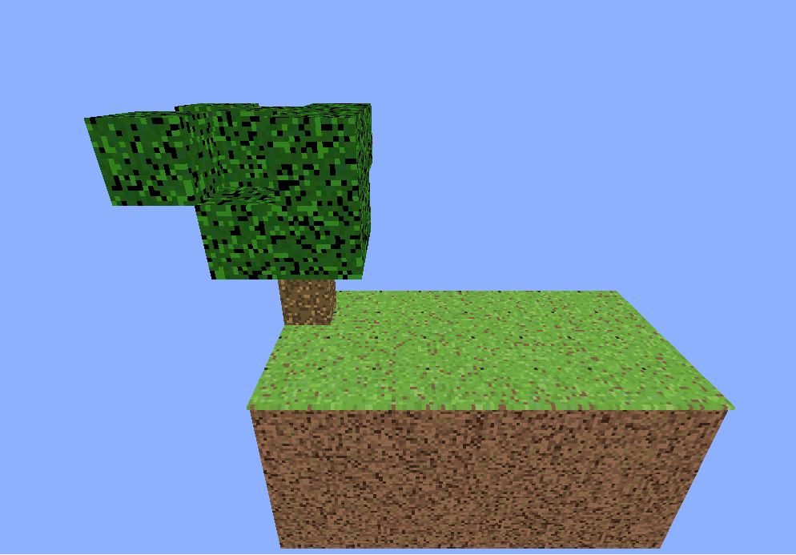

# Система Иерархии Кубов

Этот проект на Java использует библиотеки JOGL (Java OpenGL) и LWJGL (Lightweight Java Game Library) для создания системы иерархических объектов, подобной Unity. В этой системе есть якорный объект — куб, к которому можно присоединять другие кубы, создавая отношения родитель-потомок, где трансформации, примененные к родительскому кубу, влияют на все дочерние кубы.

## Особенности

- **Иерархическая система объектов**: Реализация системы, в которой объекты могут быть привязаны друг к другу, подобно иерархической системе Unity.
- **Интерактивная 3D сцена**: Пользователи могут взаимодействовать с 3D сценой, вращая камеру для просмотра структуры с разных углов.
- **Демонстрация производительности**: Показывает производительность системы с различными уровнями оптимизации.

## Демонстрация

### Пример статической сцены

Ниже представлена сцена, рендеренная в стиле Minecraft, демонстрирующая работу иерархической системы кубов:

### Концепция Skyblock

Следующее изображение показывает крайне неоптимизированную сцену с более чем 260,000 кубов. Хотя она работает медленно (примерно один кадр в 3 секунды), это демонстрирует способность системы справляться с сложными структурами:

## Оптимизация и Производительность

Этот проект демонстрирует как оптимизированные, так и неоптимизированные сцены, чтобы подчеркнуть важность эффективного рендеринга в больших 3D окружениях. В будущем улучшения могут включать:

- Реализацию отсечения по фрустуму
- Использование инстанцированного рендеринга для повторяющихся объектов
- Оптимизацию структур данных для более быстрого обхода и рендеринга

## Благодарности

- [JOGL](https://jogamp.org/jogl/www/) - Java OpenGL bindings
- [LWJGL](https://www.lwjgl.org/) - Lightweight Java Game Library
- Вдохновение от иерархической системы объектов Unity
